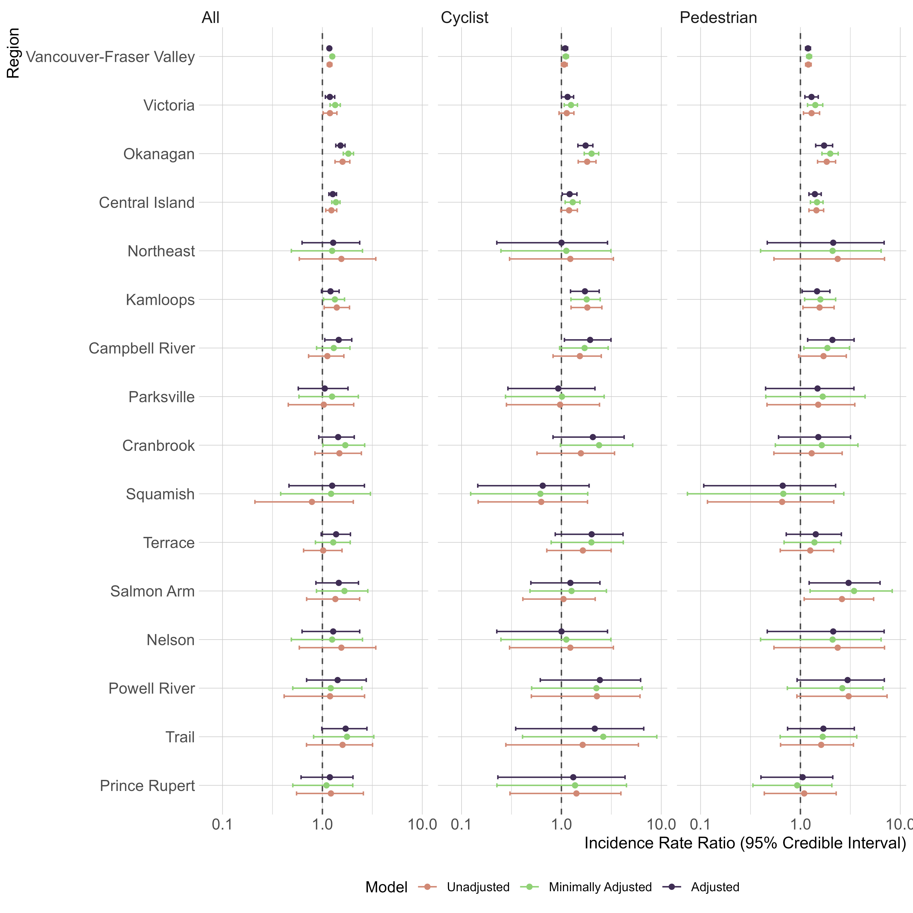

# Evaluating regional variation in neighbourhood socioeconomic inequalities in motor-vehicle injury collisions

## Overview
This repository contains the analysis code and supplementary materials for a study examining the relationship between small-area socioeconomic status (deprivation) and traffic injury crash incidence across British Columbia, Canada. The analysis focuses on spatial variations at the dissemination area level, employing Bayesian spatial modeling techniques.

## Quick Start
For users interested in running the statistical analysis only, the following files are provided:
- `da_v4_2021c.gpkg`: Main dataset aggregated to dissemination area level
- `dra_bridges_tunnels.gpkg`: Infrastructure dataset
- `05_modeling_neighbourhood_ses.R`: Statistical modeling script

### Required R Packages
```r
# Primary dependencies
library(INLA)        
library(tidyverse)   
library(sf)          
library(spdep)       

# Additional required packages
library(flextable)   
library(RColorBrewer)
library(rcartocolor) 
library(cowplot)     
library(janitor)     
library(broom)       
library(ggspatial)   
```

## Project Structure
```
├── Figures/           # Generated visualizations and maps
├── Tables/           # Generated tables for statistical models
├── Processed Data/    # Cleaned and processed datasets
├── R/                # R scripts for analysis
│   ├── 00_filter_census_data.R              # Initial census data processing
│   ├── 01_download_census_geography_and_aggregat*.R  # Geographic data preparation
│   ├── 01b_isolate_bridges_tunnels.R        # Infrastructure filtering
│   ├── 02_built_environment_measures.R       # Built environment variable creation
│   ├── 03_count_claims_by_census_geography.R # Crash counting by geography
│   ├── 04_assign_deprivation_measures.R      # SES measure assignment
│   ├── 05_modeling_neighbourhood_ses.R       # Statistical modeling
│   └── functions.R                           # Helper functions
├── Supplementary Material/ # Additional documentation and analysis
├── .gitignore        # Git ignore file
├── bc.adj           # Adjacency matrix for spatial analysis
└── README.md        # This file
```

## Data Files
### Available Data
- `da_v4_2021c.gpkg`: Final aggregated dataset at dissemination area level
- `dra_bridges_tunnels.gpkg`: Infrastructure dataset for bridges and tunnels

### Data Processing Pipeline
The scripts 00-04 document the complete data processing workflow but require access to the raw data sources which are not publicly available due to privacy considerations. These scripts are provided for methodological transparency.

## Reproducible Analysis
To run the final statistical analysis:

1. Ensure you have required R packages installed
2. Load the provided datasets:
   - `da_v4_2021c.gpkg`
   - `dra_bridges_tunnels.gpkg`
3. Run `05_modeling_neighbourhood_ses.R`

## Outcomes and Exposure

**Observed outcomes**
- Dissemination area–level counts of traffic injury crashes involving motor vehicles in British Columbia (2019–2023)
- Analyzed separately for:
  - all injury crashes
  - cyclist–motor vehicle injury crashes
  - pedestrian–motor vehicle injury crashes

**Exposure**
- Neighbourhood socioeconomic deprivation measured using the Vancouver Area Neighbourhood Deprivation Index (VanDIX)
- Census-derived composite index of socioeconomic conditions
- Standardized to have mean = 0 and standard deviation = 1

**Primary analytic outcome**
- Region-specific incidence rate ratios (IRRs) describing the association between VanDIX and injury crash incidence
- IRRs represent the change in crash incidence per one standard deviation increase in deprivation within each region

## Methods

- Traffic injury crash counts modeled using Bayesian spatial Poisson regression
- Spatial autocorrelation accounted for using Besag–York–Mollié (BYM2) models with structured and unstructured random effects
- Region-specific associations estimated by including an interaction between VanDIX and region
- Models estimated using Integrated Nested Laplace Approximation (INLA) in R
- Separate models fit for each crash type
- Models estimated sequentially as:
  - unadjusted
  - minimally adjusted (road length)
  - fully adjusted (road length + built environment covariates)

## Results

Estimated a socioeconomic gradient for each crash type in most regions. Region-specific associations between Vancouver Area Deprivation Index and traffic injury crashes in British Columbia (2019-2023) are shown below. Incidence Rate Ratios show crash risk change per standard deviation increase in deprivation from BYM2 Poisson models: unadjusted (no covariates), minimally adjusted (road length), and adjusted (full built environment). Results shown for all injury crashes, crashes involving cyclists, and crashes involving pedestrians, with 95% credible intervals



## Citation

> Branion-Calles M, Momenyan S, Erdelyi S, Chan H, Manaugh K, Winters M, Harris MA, Brubacher JR.  
> **Evaluating regional variation in neighbourhood socioeconomic inequalities in motor vehicle injury collisions.**  
> *Health & Place.* 2026;97:103586.  
> https://doi.org/10.1016/j.healthplace.2025.103586

### BibTeX
```bibtex
@article{BranionCalles2026HealthPlace,
  title   = {Evaluating regional variation in neighbourhood socioeconomic inequalities in motor vehicle injury collisions},
  author  = {Branion-Calles, Michael and Momenyan, Somayeh and Erdelyi, Shannon and Chan, Herbert and Manaugh, Kevin and Winters, Meghan and Harris, M. Anne and Brubacher, Jeffrey R.},
  journal = {Health \& Place},
  volume  = {97},
  year    = {2026},
  pages   = {103586},
  issn    = {1353-8292},
  doi     = {10.1016/j.healthplace.2025.103586}
}
